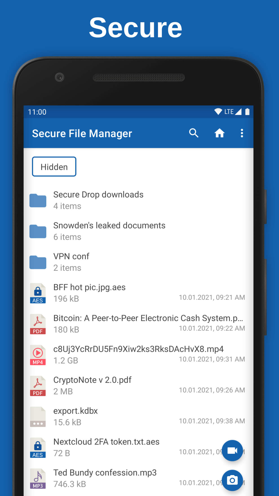
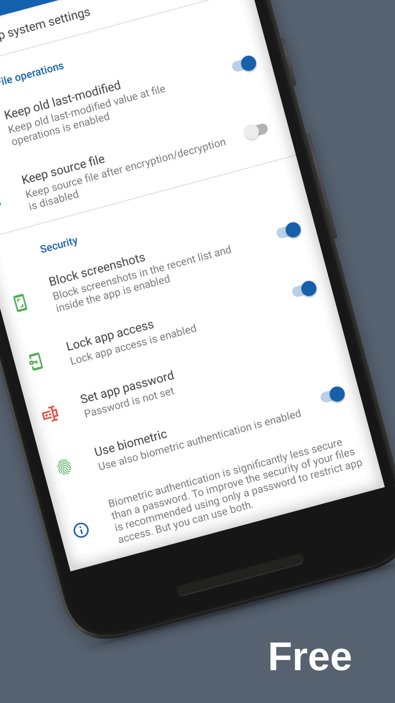
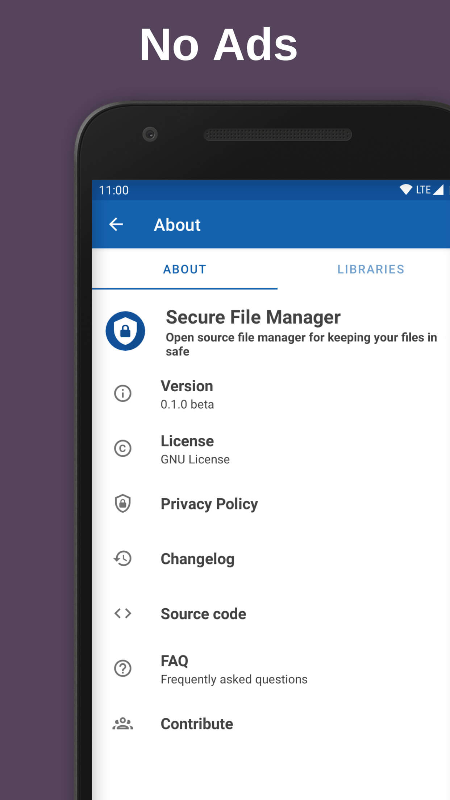
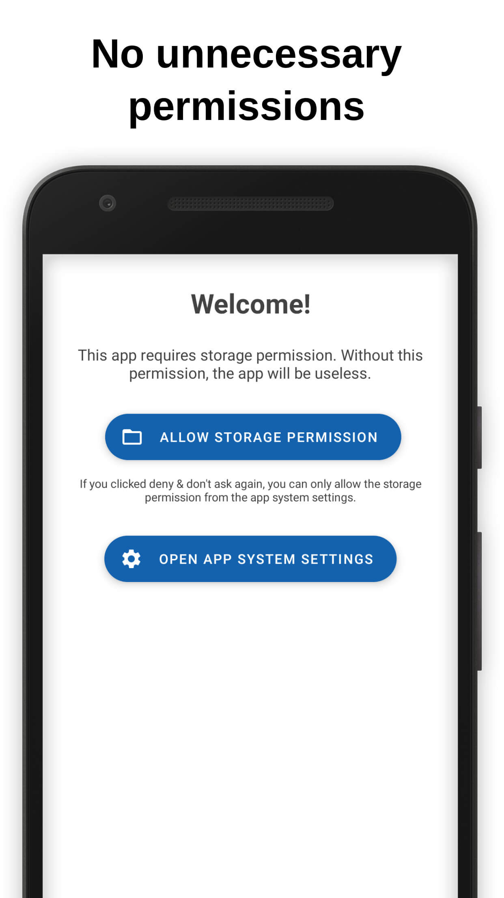
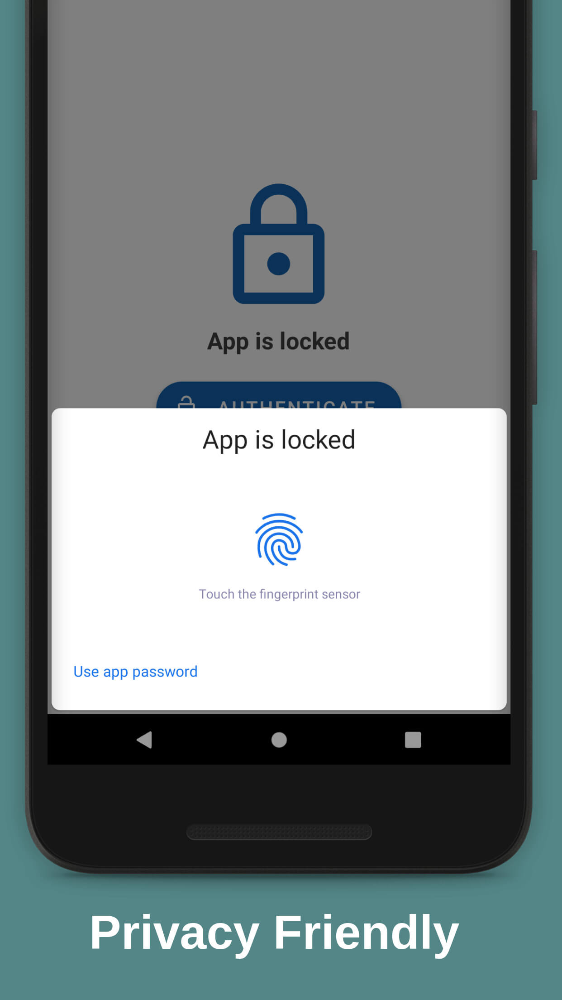
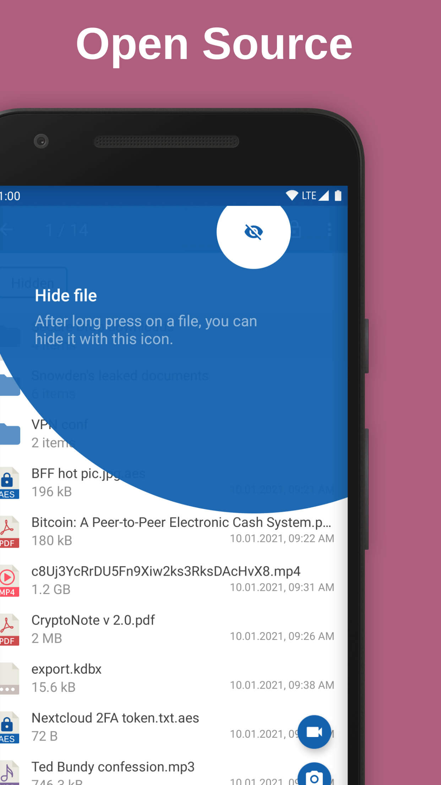

# Secure File Manager

### :bangbang: Google Play last release is outdated because updates were rejected. For this reason, the app was unpublished from Google Play. [(more here)](https://github.com/Secure-File-Manager/Secure-File-Manager/issues/36)

#### This is a beta version of the app. This means you should not use this app with important files. The developers of this app are not responsible for your data lose or corruption!

**Secure File Manager** is open source file manager for keeping your files in safe. This app is for Android 8.0+.

:heavy_check_mark: Open source

:heavy_check_mark: [Privacy friendly](./PRIVACY_POLICY.md)

:heavy_check_mark: Free

:heavy_check_mark: No ads

:heavy_check_mark: No unnecessary permissions

### Features

 - hiding files
 - encrypting files
 - Create or extract encrypted Zip files
 - lock app - password or biometric authentication *(optional)*
 - additional security features
   - disable screenshots *(optional)*
   - disabling thumbnails *(optional)*
   - clear cached thumbnails
   - set destination for creating media files *(photo / video)*
   - checksum *(MD5, SHA1, SHA256, SHA512)*

### Supported languages

 - English :us:
 - French :fr: _(thanks to [@Ilithy](https://github.com/Ilithy))_

:warning:  This app is useless if you have [a rooted device](https://github.com/Secure-File-Manager/Secure-File-Manager/wiki/Frequently-Asked-Questions#i-have-a-rooted-device-are-there-some-security-implications)!

### Screenshots

## Contributing :busts_in_silhouette:

See our [contributing doc](./CONTRIBUTING.md).

## FAQ :question:

See our [FAQ section](https://github.com/Secure-File-Manager/Secure-File-Manager/wiki/Frequently-Asked-Questions).

## Acknowledgments :heart:

This app is based on the [Simple File Manager](https://github.com/SimpleMobileTools/Simple-File-Manager).

#### Open-source components used:

 * [AboutLibraries](https://github.com/mikepenz/AboutLibraries)
 * [AppIntro](https://github.com/AppIntro/AppIntro)
 * [Argon2Kt](https://github.com/lambdapioneer/argon2kt)
 * [TapTargetView](https://github.com/KeepSafe/TapTargetView)
 * [Zip4j](https://github.com/srikanth-lingala/zip4j)
 * [Glide](https://github.com/bumptech/glide)

## License :copyright:

Licensed under the [GPLv3](./LICENSE).

F-Droid logo is trademarks of F-Droid Limited.

GitHub Play logo is trademarks of GitHub Inc.
